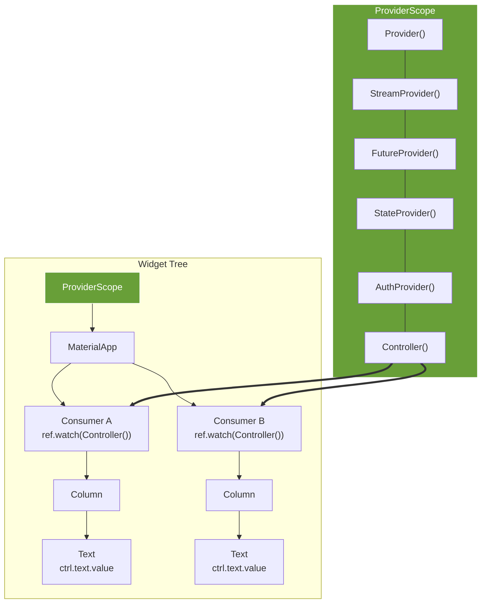

### Flutter Riverpod State Management: Introduction (2025)

This video serves as the introductory roadmap for mastering **Riverpod** in Flutter. It covers the core philosophy, benefits, and the structure of the upcoming tutorial series.

#### Why Riverpod?

Traditional methods like `setState` or *Provider* often lead to complex issues in larger applications, including:
* **Unwanted widget rebuilds:** Inefficient UI updates.
* **Testing difficulties:** Complex dependency injection and context reliance.
* **Manual resource management:** Difficulty cleaning up controllers or streams.
* **Runtime errors:** Errors occurring only when the app is running (0:44 - 1:26).

**Riverpod's key advantages include:**
* **Compile-time safety:** Catches errors during development rather than at runtime (5:34 - 6:21).
* **No context dependency:** Uses a `ref` object to access providers, simplifying access across the widget tree.
* **Test-first architecture:** Providers can be wrapped in a *ProviderContainer* for isolated unit testing (6:35 - 7:01).
* **Automatic disposal:** Efficient lifecycle management using `.autoDispose` (7:01 - 7:23).

#### How it Works

Unlike traditional state management that relies on the Flutter widget tree, Riverpod uses a `ProviderScope` placed at the top of the app. Providers exist outside the widget tree, allowing any widget to interact with them via `WidgetRef` without needing parent-child context passing.

#### Course Roadmap

**Phase 1: Manual Providers**
* **Basics:** Read-only providers, `StateProvider` (mutable), and `StatefulConsumerWidget`.
* **Async & Modifiers:** Using `FutureProvider`, `StreamProvider`, `.family`, and `.autoDispose` (11:12 - 11:24).
* **Performance:** Computed states, `select` for optimized rebuilds, and testing (11:24 - 11:36).

**Phase 2: Code Generation**
* **Setup:** Configuring the `riverpod_generator` package (11:38 - 11:48).
* **Advanced Patterns:** Using `Notifier` and `AsyncNotifier` with code generation (11:48 - 11:58).
* **Real-world Application:** Building a full To-Do app to demonstrate testing and debugging of generated providers (11:58 - 12:10).

## [*Next Topic: Static Provider*](2-static-provider.md)